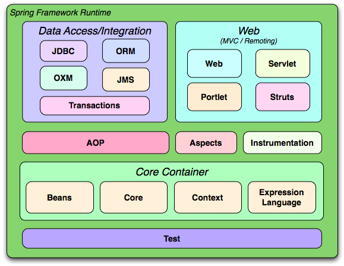

# Spring & Spring Boot

- Java ile geliştirme yapmayı kolaylaştıran Core Container, AOP, Data Access, Web gibi modüllerden oluşan bir framework-kütüphanedir.

- Spring abstract factory, singleton, IOC, DI, AOC, proxy, template tasarım desenlerini kullanır.

- Spring framework temelinde ise Spring Core modülünde yer alan IoC Container vardır.

    

    ## IoC Container Nedir? 
  
    - Nesne oluşturmak, oluşan nesnelerin ihtiyaç duyduğu nesneleri bağlamak ve yönetmek için kullanılan prensip ve desenlerinin bir araya geldiği araçlardır

    ## IoC(Inversiyon of Control) Nedir?

    - Bir sınıfın, içerisinde kullanılan sınıfların başka yöntemlerle oluşturulması, yönetilmesi, dahil edilmesine denir. Sınıflardan nesne oluşturmak, oluşan nesnelerin ihtiyaç duyduğu nesneleri bağlamak ve yönetmek için kullanılan prensip ve desenlerinin bir araya geldiği araçlardır.
  
    ## DI(Dependency Injection) Nedir?

    - Dependency injection, bir sınıfın/nesnenin bağımlılıklardan kurtulmasını amaçlayan ve o nesneyi olabildiğince bağımsızlaştıran bir programlama tekniği/prensibidir. 3 farklı DI yöntemi vardır.
    - Dependency Injection, IOC'nin bir uygulamasıdır.

    1. Constructor Injection: Direkt olarak constructor metod içerisinde injection yapar.
 
       ```code
       public class Consumer {
 
         Developer developer;
 
         // Constuctor Injection
         public Consumer(Developer developer){
             this.developer = developer;
         }
       }  
       ```

    2. Setter Injection: Set metodu kullanarak yapılan Injection işlemine denir.

       ```code
       public class Consumer {
 
         Developer developer;
 
         // Setter Injection
         public void setDeveloper(Developer frontDev) {
             this.developer = frontDev;
         }
       }  
       ```

    3. Autowired:

       ```code
       @Service
       public class UserService {

         @Autowired
         private UserRepository userRepository;
       }  
       ```

    ## Spring vs Spring Boot

    1. Spring boot, spring üzerine inşa edilmiş bir framework'dür.
    2. Springde uygulamayı çalıştırmak için sunucuyu açıkca ayarlamak gerekirken, spring boot'da tomcat, jetty gibi sunucular gömülü olarak gelir.
    3. Spring uygulamasını çalıştırmak için deployment descriptor gerekliyken, spring boot'da gerekli değildir.
    4. Spring boot'da h2 gibi bellek içi db desteği varken, springde yoktur.
    5. Spring'de bağımlılıkları pom.xml dosyasına el ile tanımlamak gerekirken, spring boot bağımlılıkları dahili olarak işler.

    ## Bean Nedir?

    - Spring Framework uygulamamızın omurgasını oluşturan ve Spring IOC container tarafından yönetilen nesnelere BEAN denir. Yeniden kullanılabilir objelerdir.

    | Anotasyon    |Tanım                                                                                                 |
    |--------------|:----------------------------------------------------------------------------------------------------:|
    | **@Bean**    |  Application contexte return tipinde belirtilen tipte bir objenin bean olarak ekleneceğini belirtir. |

    ## Bean Lifecycle

    - Spring container tarafından yönetilir. Container oluşturulmasıyla birlikte bütün bean'ler oluşturulur ve bağımlılıklar inject edilir.

      

	- Bean Lifecycle uygulamak için 3 yolumuz vardır.

    1. XML:
		- Bu yaklaşımda, bir bean için özel init() ve destroy() metotlarından yararlanmak için, bir bean tanımlarken bu iki metodu Spring XML yapılandırma dosyasına kaydetmemiz gerekir. 
        Öncelikle bir class oluşturup için init() ve destroy() metodları eklememiş gerekiyor.

            ```code
            public class HelloWorld {
            
                public void init() throws Exception{
                    System.out.println("Bean HelloWorld has been"); 
                }

                public void destroy() throws Exception{
                System.out.println("Container has been closed");
                }
            }
            ```
        - Daha sonrasında spring.xml config dosyasına bean'i belirtmemiz gerekir.

            ```xml
            <beans>
    	    		<bean id="hw" class="beans.HelloWorld"
                	init-method="init" destroy-method="destroy"/> 
		    </beans>
            ```

    2. Programatik Yaklaşım

        -Bu yaklaşımda bean class'ımıza InitializingBean ve DisposableBean implement edilir.
		- Class içerisinde afterPropertiesSet() ve destroy() yöntemi, afterPropertiesSet() container başladığında çağrılır ve bean'i başlatılırken, destroy() yöntemi, container kapatıldıktan hemen sonra çağrılır.

            ```code
            import org.springframework.beans.factory.DisposableBean;
            import org.springframework.beans.factory.InitializingBean;
    
            public class HelloWorld implements InitializingBean,DisposableBean {
            
                @Override
                public void afterPropertiesSet() throws Exception{
                    System.out.println("Bean HelloWorld has been");    
                }
    
                @Override
                public void destroy() throws Exception
                {
                    System.out.println("Container has been closed ");
                }
            }
            ```

        - Ardından spring.xml içerisine  bean'i belirtmek gerekir.

            ```xml
                <beans>
    	        	<bean id="hw" class="beans.HelloWorld"init-method="init"    destroy-method="destroy"/> 
		        </beans>
            ```
    3. Anotasyon Kullanımı

        - Init yöntemine @PostConstruct, destroy() metoduna ise @PreDestroy anotasyonu eklenir.  

            ```code
            import javax.annotation.PostConstruct;
            import javax.annotation.PreDestroy;
    

            public class HelloWorld {

                @PostConstruct
                public void init() throws Exception
                {
                    System.out.println("Bean HelloWorld has been ");
                }   

                @PreDestroy
                public void destroy() throws Exception
                {
                    System.out.println("Container has been closed ");
                }
            }     
            ```

        - XML Dosyası

            ```xml
            <beans>
    	       	<bean id="hw" class="beans.HelloWorld"init-method="init"        destroy-method="destroy"/> 
		    </beans>
            ```
    ## Bean Scope

    - Bean scope, bean'nin ne zaman oluşturulacağını ve ne zaman yok olacağını belirler. 5 farklı scope türü vardır.

    1. Singleton:
        * Singleton kapsamındaki bir Bean, Spring Container tarafından yalnızca bir kez oluşturulur ve tüm istekler aynı örneğe yönlendirilir. Spring continer'ın yok edilmesiyle singleton kapsamındaki bean'ler yok edilir.

    2. Prototype:
		* Prototype kapsamındaki bir Bean’in her istek için yeni bir örneği oluşturulur ve Spring Container tarafından yönetilmez.

    3. Request:
		* Request kapsamı, bir HTTP isteği için bir örnek oluşturulduğunda oluşturulan Bean’in kapsamıdır. Request kapsamındaki bir Bean, bir HTTP isteği için bir kez oluşturulur ve yalnızca o istek için kullanılır. Request kapsamındaki bir Bean, Spring Container tarafından yönetilir ve istek tamamlandığında yok edilir.
    
    4. Session:
		* Session kapsamı, bir HTTP isteği için bir örnek oluşturulduğunda oluşturulan Bean’in kapsamıdır. Session kapsamındaki bir Bean, bir HTTP isteği için bir kez oluşturulur ve yalnızca o istek için kullanılır. Session kapsamındaki bir Bean, Spring Container tarafından yönetilir ve oturum sonlandırıldığında yok edilir.
    
    5. Global Session:
		* Global Session kapsamı, bir HTTP isteği için bir örnek oluşturulduğunda oluşturulan Bean’in kapsamıdır. Global Session kapsamındaki bir Bean,	bir HTTP isteği için bir kez oluşturulur ve yalnızca o istek için kullanılır. Global Session kapsamındaki bir Bean, Spring Container tarafından	yönetilir ve oturum sonlandırıldığında yok edilir.

    - Session vs Global Session:
		Session kapsamı, bir HTTP isteği için bir örnek oluşturulduğunda oluşturulan Bean’in kapsamıdır. Session kapsamındaki bir Bean, bir HTTP isteği	için bir kez oluşturulur ve yalnızca o istek için kullanılır. Global Session kapsamındaki bir Bean ise, bir HTTP isteği için bir kez oluşturulur ve tüm oturumlar için kullanılır. Global Session kapsamındaki bir Bean, Spring Container tarafından yönetilir ve uygulama sonlandırıldığında yok edilir.